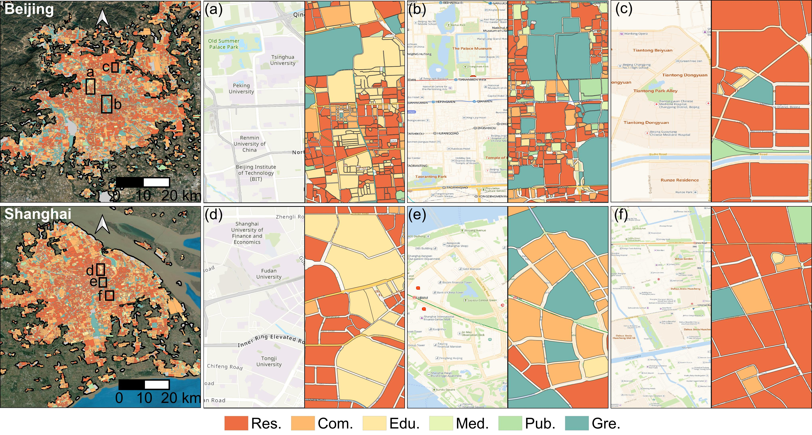
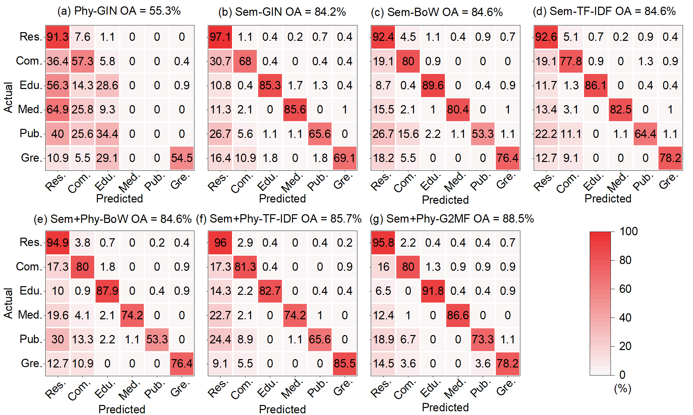

<h1 align="center">A graph-based multimodal data fusion framework for identifying urban functional zone</h1>


    
This is the official PyTorch implementation of the paper **[A graph-based multimodal data fusion framework for identifying urban functional zone](https://www.sciencedirect.com/science/article/pii/S1569843224007118)**.

Note: The app and codes we developed, data, and trained models will be released upon acceptance of the paper.

GUI of **An Intelligent Toolbox for Identifying Urban Functional Zone**, which is developed based on the proposed G2MF.

 [Click me for HD video on YouTube!](https://www.youtube.com/watch?v=FZLEjUOS45I)

<div><video controls src="https://private-user-images.githubusercontent.com/114664167/348947028-76e89c46-922c-4150-96db-3eb3460f7662.mp4?jwt=eyJhbGciOiJIUzI1NiIsInR5cCI6IkpXVCJ9.eyJpc3MiOiJnaXRodWIuY29tIiwiYXVkIjoicmF3LmdpdGh1YnVzZXJjb250ZW50LmNvbSIsImtleSI6ImtleTUiLCJleHAiOjE3MjExMDY3MjgsIm5iZiI6MTcyMTEwNjQyOCwicGF0aCI6Ii8xMTQ2NjQxNjcvMzQ4OTQ3MDI4LTc2ZTg5YzQ2LTkyMmMtNDE1MC05NmRiLTNlYjM0NjBmNzY2Mi5tcDQ_WC1BbXotQWxnb3JpdGhtPUFXUzQtSE1BQy1TSEEyNTYmWC1BbXotQ3JlZGVudGlhbD1BS0lBVkNPRFlMU0E1M1BRSzRaQSUyRjIwMjQwNzE2JTJGdXMtZWFzdC0xJTJGczMlMkZhd3M0X3JlcXVlc3QmWC1BbXotRGF0ZT0yMDI0MDcxNlQwNTA3MDhaJlgtQW16LUV4cGlyZXM9MzAwJlgtQW16LVNpZ25hdHVyZT02ZWI4MTgyODRjMzU3ZWIwYjliOGQyY2UwY2JlMjQ0NjcwMjY2ZGFlNDVhZjYxMWI2MmI3MTYwNGFhYzNmMDgyJlgtQW16LVNpZ25lZEhlYWRlcnM9aG9zdCZhY3Rvcl9pZD0wJmtleV9pZD0wJnJlcG9faWQ9MCJ9.Im-YvvJ9fx-nMrxAY-20FeMiD5cTjehFP1D-IMCw2DE" muted="false"></video></div>

 

Geographical location of study areas
  
  


### Table of content
1. [Preparation](#preparation)
2. [Run APP](#APP)
3. [Training G2MF](#G2MF)
4. [UFZ Identification](#results)
5. [Sensitivity Analysis of G2MF](#discussion)
6. [Paper](#paper)
7. [Outlook](#outlook)
8. [License](#license)

### 1. Preparation
- Recommendation: Install a virtual env: `conda create -n g2mf python=3.11`
- Install required packages: `pip install -r requirements.txt`
  
### 2. Run APP <a name="APP"></a>
- Run APP:
```
$ cd G2MF-main/app
$ pip install -r requirements.txt
$ python main_async_elite.py
```

### 3. Training G2MF <a name="G2MF"></a>
- Train G2MF:
```
$ cd G2MF-main/src
$ python train.py --data_dir /Path/To/DATASET/
```

### 4. UFZ Identification <a name="results"></a>
- **Beijing-Shanghai:** Visualization of some UFZ inference results in Beijing and Shanghai. We show some typical places, such as the university campus in Haidian District (Beijing), green spaces and squares surrounding the Forbidden City (Beijing), the Tiantongyuan residential area in Changping District (Beijing), the university campus in Yangpu District (Shanghai), the Lujiazui commercial area in Pudong New Area (Shanghai), and the largest residential complex in the Pudong (Shanghai). Zoom-in for better details.


- **Nanjing-Hefei:** Visualization of UFZ inference results with geographically isolated areas (Nanjing and Hefei).
<div  align="center">

</div>

- **Visualization for comparison with different algorithms:** Comparison of details of functional areas identified by different methods in Beijing (Chaoyang District, Haidian District), Shanghai, Nanjing and Hefei.


- **Confusion matrix for comparison with different algorithms:** Confusion matrix of all comparison experiments. 


- VHR images, physical objects, semantic objects, and pie charts of these two objects in Beijing (Chaoyang District, Haidian District), Nanjing, and Hefei. 


### 5. Sensitivity Analysis of G2MF <a name="discussion"></a>
- **The impact of deep learning models and graph structures on the proposed framework.**

<div  align="center">

</div>

### 6. Paper <a name="paper"></a>
**[A graph-based multimodal data fusion framework for identifying urban functional zone](https://www.sciencedirect.com/science/article/pii/S1569843224007118)**

Please cite the following paper if you find it useful for your research:
```
@article{tao2024g2mf,
  title={A graph-based multimodal data fusion framework for identifying urban functional zone},
  author={Yuan Tao, Wanzeng Liu, Jun Chen, Jingxiang Gao, Ran Li, Xinpeng Wang, Ye Zhang, Jiaxin Ren, Shunxi Yin, Xiuli Zhu, Tingting Zhao, Xi Zhai, and Yunlu Peng},
  year={2024}
}
```

### 7. Outlook <a name="outlook"></a>
We are trying to produce national-scale UFZs, click **stars** to continue following.

### 8. License <a name="license"></a>
This repo is distributed under [GLPv3 License](https://www.gnu.org/licenses/gpl-3.0.en.html). The code can be used for academic purposes only.
